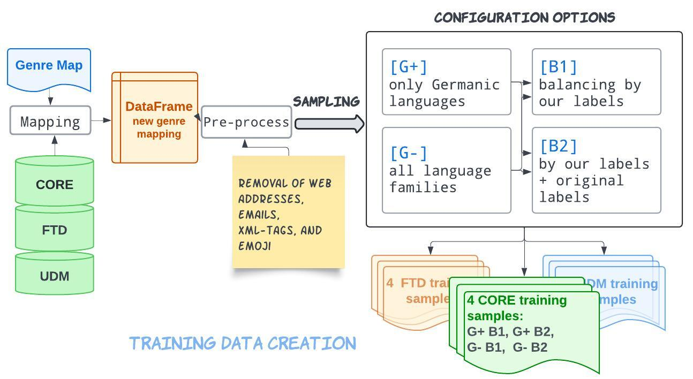

# Zero-Shot Genre Classification Experiment

Cross-domain, cross-lingual genre classification for the ActDisease corpus, using web-genre datasets as training data. Part of the paper **"Classifying Textual Genre in Historical Magazines (1875–1990)"** (LaTeCH-CLfL 2025).

## Overview

The key insight of this experiment is that publicly available web-genre datasets (CORE, FTD, UDM) can be repurposed as training signal for a different domain (historical medical magazines) and different languages, *without any in-domain labelled data* — a zero-shot setting.

**Pipeline:**

1. **Prepare datasets** — download and preprocess CORE, FTD, and/or UDM; map their labels to a unified genre scheme; chunk long texts; balance by label; split train/test.
2. **Train classifier** — fine-tune a multilingual BERT-family model on the prepared train split.
3. **Predict** — run the trained model on the ActDisease test set and evaluate.

**Models trained:**

| Config | Base model |
|--------|-----------|
| `configs/training/xlmroberta.yaml` | `FacebookAI/xlm-roberta-base` |
| `configs/training/hmbert.yaml` | `dbmdz/bert-base-historic-multilingual-cased` (hmBERT) |
| `configs/training/mbert.yaml` | `google-bert/bert-base-multilingual-cased` (mBERT) |

**Training sources:**

| Config | Dataset(s) |
|--------|-----------|
| `configs/datasets/CORE.yaml` | CORE + FinCORE + SweCORE + FreCORE |
| `configs/datasets/FTD.yaml` | FTD (English + Russian) |
| `configs/datasets/UDM.yaml` | Universal Dependencies Multi-Genre |
| `configs/datasets/merged.yaml` | CORE + FTD + UDM combined |

## Repository Structure

```
zero-shot-experiment/
├── mapping_utils.py            # Label maps (v1/v2/v3) & language families
├── dataset_utils.py            # Load / preprocess / balance / split
├── prepare_dataset.py          # CLI: produce train.csv + test.csv
├── train.py                    # CLI: fine-tune a classifier
├── predict.py                  # CLI: predict on a test set
├── configs/
│   ├── datasets/
│   │   ├── CORE.yaml
│   │   ├── FTD.yaml
│   │   ├── UDM.yaml
│   │   └── merged.yaml
│   └── training/
│       ├── xlmroberta.yaml
│       ├── hmbert.yaml
│       └── mbert.yaml
├── data/                       # Created at runtime (not tracked)
│   ├── zero-shot_data/         # Raw downloaded data
│   └── prepared/               # Train/test CSVs per configuration
├── output/                     # Model checkpoints (not tracked)
├── results/                    # Evaluation outputs (not tracked)
├── zero-shot-pipeline.jpeg     # Balancing strategy illustration
└── requirements.txt
```

## Balancing Strategy

The balancing strategy equalises label frequency at two levels: first by top-level genre label (capped at the median), then by sublabel (original dataset label) within each genre. This prevents dominant genres or datasets from overwhelming the training signal.



Concretely, for each genre label:
- If the genre count > median: budget = median; distribute equally across its original sublabels.
- Otherwise: budget = actual count; still distribute equally across sublabels.

This produces datasets that are balanced both across genres *and* across source-dataset labels within each genre.

## Label Mapping Versions

Three mapping versions define how source-dataset labels collapse into unified genre labels:

| Version | Classes | Key differences |
|---------|---------|-----------------|
| `cl_map_v1` | 9 | Finest-grained; separate news, QA, legal |
| `cl_map_v2` | 6 | News merged into nonfiction; QA/legal merged into guide/administrative |
| `cl_map_v3` | 9 | Same classes as v1 but alternative CORE/FTD assignments for QA |

Set `mapping: cl_map_v3` (default) in dataset configs to use the scheme from the paper.

## Setup

```bash
pip install -r requirements.txt
```

## Usage

### Step 1 – Prepare data

**Download raw datasets (optional — skip if already present):**

Set `download: true` in the dataset config, or run manually:

```python
from dataset_utils import download_CORE, download_FTD
download_CORE("data/zero-shot_data")
download_FTD("data/zero-shot_data")
```

> **UDM (Universal Dependencies Multi-Genre)** must be obtained manually.
> Download the relevant UD treebanks from https://universaldependencies.org/,
> place them under `data/zero-shot_data/UDM/<genre>/<UD_Language-Treebank>/`,
> where `<genre>` is the UD genre tag (e.g. `fiction`, `news`, `academic`).

**Run preparation:**

```bash
# Single dataset
python prepare_dataset.py configs/datasets/CORE.yaml
python prepare_dataset.py configs/datasets/UDM.yaml
python prepare_dataset.py configs/datasets/FTD.yaml

# All three merged
python prepare_dataset.py configs/datasets/merged.yaml
```

Output is written to `data/prepared/<config_id>/train.csv` and `test.csv`.

### Step 2 – Fine-tune

Point the training config to the desired train/test CSVs, then run:

```bash
# XLM-RoBERTa on UDM (recommended baseline)
CUDA_VISIBLE_DEVICES=0 python train.py configs/training/xlmroberta.yaml

# hmBERT (best results on ActDisease in the paper)
CUDA_VISIBLE_DEVICES=0 python train.py configs/training/hmbert.yaml

# mBERT
CUDA_VISIBLE_DEVICES=0 python train.py configs/training/mbert.yaml
```

To train on a different dataset, change `train_file` / `test_file` in the config:

```yaml
train_file: data/prepared/merged__lff__v3__chunked__balanced/train.csv
test_file:  data/prepared/merged__lff__v3__chunked__balanced/test.csv
```

Models and evaluation outputs are saved under `output/<run_name>/`.

### Step 3 – Predict

```bash
python predict.py \
    --model_dir output/train__xlmroberta-base/best_model \
    --test_file path/to/actdisease_test.csv \
    --output_dir results/xlmroberta_UDM
```

Outputs: `predictions.csv`, `classification_report.txt`, `confusion_matrix.png`.

## Configuration Reference

### Dataset configs (`configs/datasets/*.yaml`)

| Key | Description | Default |
|-----|-------------|---------|
| `dataset` | `CORE` / `FTD` / `UDM` / `merged` | required |
| `data_dir` | Root folder for raw data | required |
| `download` | Download raw data before processing | `false` |
| `mapping` | Label mapping version | `cl_map_v3` |
| `language_family_filter` | List of language families to keep (null = all) | `null` |
| `chunking` | Chunk texts > 512 tokens | `true` |
| `model_name` | Tokenizer for length measurement | `FacebookAI/xlm-roberta-base` |
| `remove_punctuation` | Strip non-alphanumeric chars | `false` |
| `remove_short` | Drop texts < 6 words | `true` |
| `balance` | Apply two-level genre balancing | `true` |
| `test_size` | Fraction held out as test set | `0.2` |
| `random_state` | Random seed | `42` |
| `output_dir` | Where to write train/test CSVs | `data/prepared` |

### Training configs (`configs/training/*.yaml`)

| Key | Description | Default |
|-----|-------------|---------|
| `model_name` | HuggingFace model ID | required |
| `train_file` | Path to train.csv | required |
| `test_file` | Path to test.csv (optional) | `null` |
| `learning_rate` | AdamW learning rate | `1e-5` |
| `batch_size` | Per-device batch size (train & eval) | `8` |
| `num_epochs` | Training epochs | `5` |
| `weight_decay` | AdamW weight decay | `0.01` |
| `valid_split` | Internal validation fraction | `0.1` |
| `random_state` | Random seed | `42` |
| `chunk_at_training` | Chunk long texts at training time | `false` |
| `output_dir` | Root directory for model saves | `output` |

## Reference

```bibtex
@inproceedings{danilova-soderfeldt-2025-classifying,
    title = "Classifying Textual Genre in Historical Magazines (1875-1990)",
    author = {Danilova, Vera and S{\"o}derfeldt, Ylva},
    booktitle = "Proceedings of the 9th Joint SIGHUM Workshop on Computational Linguistics for Cultural Heritage, Social Sciences, Humanities and Literature (LaTeCH-CLfL 2025)",
    month = may,
    year = "2025",
    address = "Albuquerque, New Mexico",
    publisher = "Association for Computational Linguistics",
    url = "https://aclanthology.org/2025.latechclfl-1.15/",
    doi = "10.18653/v1/2025.latechclfl-1.15",
    pages = "160--171"
}
```
